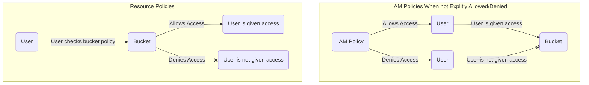
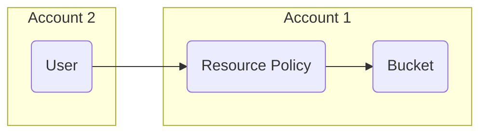

# Managing Permissions in S3

## Bucket Policies vs. IAM

- Bucket Policies (Resource based)
    - Defined at the bucket resources
        - Give a principal[^1] access to all objects or a subset of objects in a bucket
        - Can explictly allow or deny access
        - Overrides all permissions that are granted

- IAM Policies (Identity Based)
    - Grants temporary permissions with a role to a user, service, or application
        - Given through the console or programatically
        - As long as the role can be assumed, the bucket can be used

Access Workflow:

## Sharing Across Accounts
- IAM account must check resource policy if they are explicitly allowed based on their unique id
- If the account is neither allowed or denied access the primary account must:
    - Establish the permissions and trust policy
        - Permissions policy needs access to the S3 bucket
        - Update trust policy to allow an entity from a secondary account to assume this role
    - Secondary account must give itself permissions to assume the role that was created in the primary account
        - This allows the user to assume the role in the primary account that has access to the S3 Bucket

## Connecting to Resources
- The principal, trust policy, or entity that assumes the role does not need to be a user, it could also be:
    - EC2 instance
    - Lambda
    - Assigned programatticaly to a custom applications
- Advantage to using IAM:
    - Access keys to get access to the S3 bucket are constantly rotated by AWS
    - If principal access is granted using a bucket policy, S3 objects can be vulnerable if the access key is leaked
- Example:
    - EC2 instance in the public subnet
        - Is already given a role to access our S3 bucket
    - Options to send or receive objects from the bucket:
        1. Internet gateway leads to the public internet that leads to the S3 bucket
            - Going in and out of the public internet can be expensive
        2. Use an S3 Gateway Endpoint (ENI - Elastic Network Interface)
            - Allows EC2 instance to traverse through the AWS private intranet
            - Costs and latency can be lower
            - Set the correct route in the route table of the VPC

## Things to Take Away
- Access to an S3 bucket can be given via Bucket Policies or IAM roles
    - Explicitly allows or denies access to principles with bucket policies.
    - Bucket policies take precedence over principals and IAM policies
    - IAM roles can grant access if it's not denied by bucket policies
- Cross account access is possible via Trust Policies and IAM roles
    - Trust policies and IAM roles grant principles access to S3 objects even if it is not the same AWS account
    - Trust policies can specify which principles are allowed to assume the role to access S3 objects
    - These trusts policies are more secure than bucket policies because the access keys associated with IAM roles are constantly rotated
- Efficiency is increased by using S3 endpoints
    - Sending data through the public web is expensive
    - Easier, cheaper, and faster to use an elastic network interface to traverse AWS' private intranet

[^1]: The Principal element specifies the user, account, service, or other entity that is allowed or denied access to a resource. The following are examples of specifying Principal.