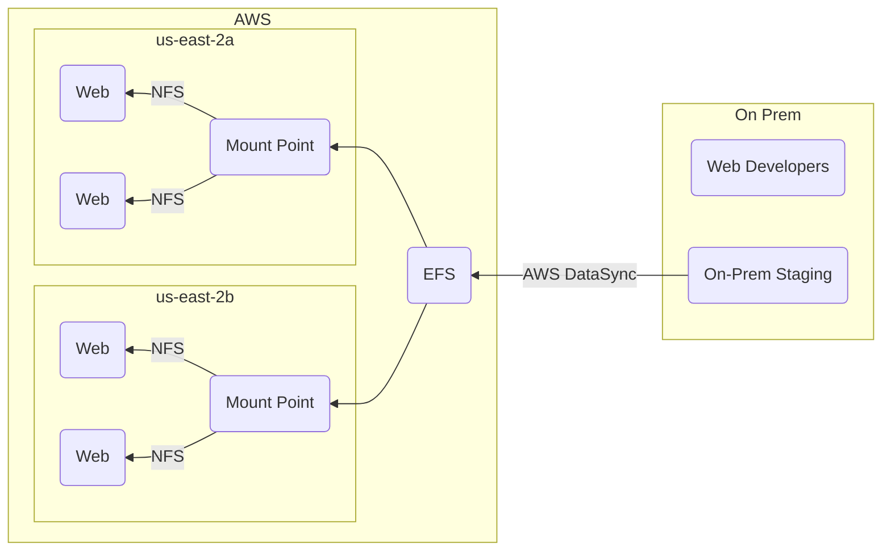

# Amazon Elastic File Service (EFS)
- Implementation of NFS[^1] file share
- Elastic storage capacity, and pay for only what you use
- Available in multiple availability zones in a given region
    - This is good for data redundancy
- Can configure mount-points in one or many availability zones
    - Can be mounted from on-prem systems
        - Needs fast and stable connection, such as direct connect[^2]
        - Is not secure
    - NFS is not a secure protocol, recommendation would be to to use a secure tunnel or VPN connection
    - Use DataSync[^3] to keep storage on prem in sync with EFS or S3 over a direct connect
        - Supports EFS to EFS sync if you want to keep EFS shares in sync

> [!NOTE]
> - EFS costs are usually three times more expensive than elastic block storage (EBS)
> - EFS costs are usually 20 times more expensive than S3
> - Some NFS features are not supported
---

## Use Case
**Example**:
We have a dynamic web app that cannot be hosted in S3. We can use DataSync to sync the on-prem resources to EFS.
The EFS data can be exposed via mount points in two different availability zones that our web servers have access to.
By doing this, our web app is able to scale properly at higher loads as well as have data redundancy across availability zones.

[^1]: Network file system: Mechanism for storing files on a network. It is a distributed file system that allows users to access files and directories located on remote computers
[^2]: Links your internal network to an AWS direct connect location over a standard ethernet fiber-optic cable. This allows users the ability to create a virtual interface directly towards a public AWS service, bypassing internet service providers
[^3]: Service that makes use of a purpose-built protocol (performs optomizations on how, when, and what data is sent over the network)