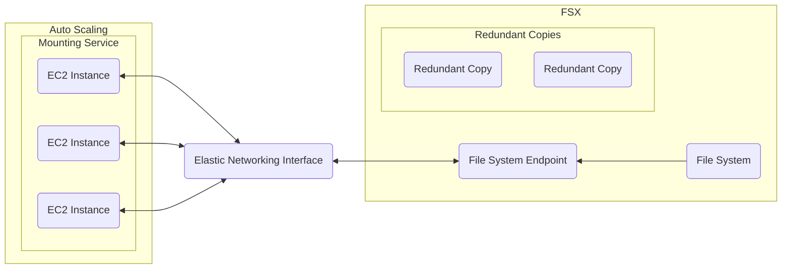

# FSx

## Introduction to FSx
- Used for jobs elastic file share (EFS) cannot solve
- Provides non-network file system (NFS) potions for file sharing
- Most commonly used for Windows file services integration with AWS
    - AWS handles the scaling and availability of the data held in FSx

## Four Flavors of Fsx
- Meant to give a cloud-native experience for file share protocols that are commonly used
- Designed to work with with four different file sharing protocols:
    - FSx for NetApp ONTOP
    - FSx for OpenZFS
    - FSx for Windows File Server (Common use case)
    - FSx for Lustre (Common use case)

## How Does It Work?
**Example:**
We have an auto scaling group of EC2 instances. These instances are considered mount targets for our file system.
The file system managed by AWS has an endpoint that our mount targets can be configured to have access to.
For the networking, the endpoint and mount targets will communicate through an elastic networking interface.
By default, FSx will store redundant copies of the files/data where they are being stored.
In the case that there is an outage of AWS' infrastructure, FSx would still allow the availability of these files/data.

> [!NOTE]
> - Can give access through IAM roles, though most common, users use the Managed Microsoft AD that is already being used for their Windows servers.
> - Lustre uses SSDs to hold redundant data instead of automatically storing it with the original data, it also leverages S3 as a cold storage to store snapshots and less-frequently accessed files in the system.

## Exploring Use Cases
### FSx For Windows File Server (If a question is asking about):
- Windows line-of-business[^1] aplication
    - Setting up a file share in the AWS cloud
- Utilize Windows content management systems
- Create a solution for media processing workflows on Windows machines
- Do Windows data analytics on Windows machines

#### Why?
- Highly scalably
- Highly available
- Cloud Native solution

### FSx For Lustre (If a question is asking about):
- High-performance distributed applications
- High-performance compute clusters
- Can reliably interact with thousands of EC2 instances
- Big data and machine learning applications

#### Why?
- One of the most popular
- One of the most high performant file storage systems in use today

## Exam Tips
- Will only see a few questions pertaining to FSx
- FSx covers several file share use cases
    - Most commonly used for Windows File Server
    - Can also be used for ONTAP, OpenZFS, and Luster with deep AWS integration
- FSx for Windows File Server tips:
    - SMB[^2]-based file shares that EFS is not compatible with, FSx is a great alternative
    - AWS automatically handles management and scalability of the servers
    - Only thing that must be handled is access via IAM or Managed Microsoft AD
- FSx for Lustre for modern HPC[^3] storage tips:
    - Strategically organizes data on SSds to optimize the most used data for fast access
    - Designed for high performace
    - Integrations with S3 as cold storage
    - Can access thousands of mount targets at a time

[^1]: Line-of-business (LOB): Critical computer applications that are vital to running an enterprise. LOB applications are usually large programs that contain a number of integrated capabilities and tie into databases and database management systems.
[^2]: Server message block (SMB): Allows applications on a computer to read and write files to request services from server programs in a computer network.
[^3]: High performance computing (HPC): Practice of aggregating computer power in a way that delivers much higher horsepower than traditional computers and servers.