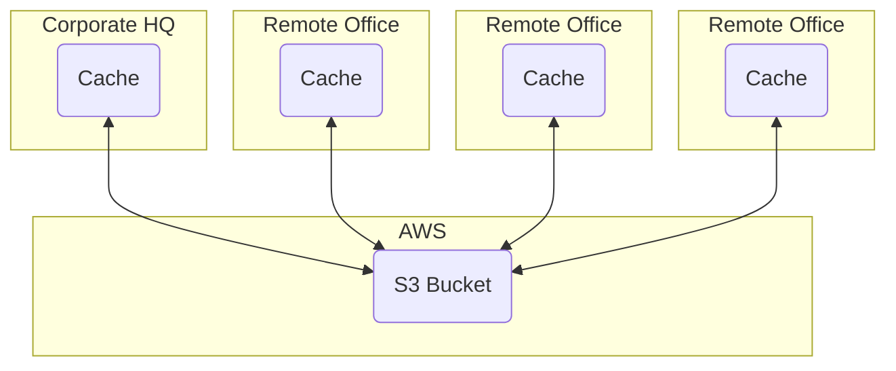

# Amazon Storage Gateway
- Virtual machine that you can run on-prem with VMWare, HypverV, or via a specially configured Dell hardware appliance
- Provides local storages resources backed by AWS S3 and Glacier
    - Can create a storage gateway in a local data center
        - Can mount volumes locally in the data center
        - Contains logic to syncronize data between the data center and S3/Glacier
- Often used in disaster recovery to sync to AWS
- Useful in cloud migrations
    - Can act as a "lazy" way to slowly synchronize data between on-prem and the cloud
- Contains a feature called bandwidth throttling[^1]

## Modes Storage Gateway Can Run Under:

| Old Name                     | New name (Modern)          | Interface | Function                                                                          |
| :--------------------------- | :------------------------- | :-------- | :-------------------------------------------------------------------------------- |
| None                         | File Gateway               | NFS, SMB  | Allow on-prem or EC2 instances to store objects in S3 via NFS or SMB mount points |
| Gateway-Stored Volumes       | Volume Gateway Stored Mode | iSCI      | Async replication of on-prem data to S3                                           |
| Gateway-Cached Volumes       | Volume Gateway Cached Mode | iSCI      | Primary data stored in S3 with frequently acceed data cached locally on-prem      |
| Gateway-Virtual Tape Library | Tape Library               | iSCI      | Virtual media changer and tape library for use with existing backup software      |

- The exam usually calls these by their old names, not their new names
- File Gateway exposes volumes as NFS or SMB shares.
    - Data is replicated to S3
- Volume Gateway Stored Mode exposes volumes as iSCI
    - Asynchronously replicates data to S3
- Volume Gateway Cached Mode exposes volumes as iSCI
    - Primary data is stored on S3
    - On-prem data (local data) is data that has been recently accessed
    - Helps with the transition from on-prem to the cloud
- Tape Library exposes volumes as iSCI
    - Designed to be a virtual media changer and virtual tape library
    - Meant to support back-up software

## Example:
Implementation of a company implementing Volume Gateway Cached Mode between HQ and remote offices.
This allows a synchronized file experience for all offices, and is 11 nines percent[^2] durable across all offices.

[^1]: Bandwith throttling: Intentional limitation of the communication speed of the in/outgoing data in a network.
[^2]: Eleven nines: Quicker way of saying 99.999999999%