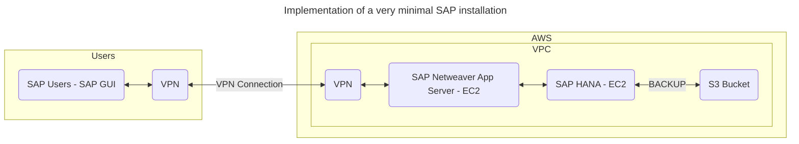

# Databases on EC2
- Can run any database with full control and ultimate flexibility
- Must manage everything like backups, redundancy, patching, and scale
- Good option if you require a database not yet supported by RDS such as:
    - IBM DB2
    - SAP HANA
- Good option if it is not feasible to migrate to an AWS-managed database

## Example Architecture
**Example:**
SAP HANA is not supported by RDS, and will need to be ran on an EC2 instance.
This is done by using a normal SUSE or Red Hat AMI to manually install a database on that platform.
There are a few third party tools to help manage HANA on AWS

> [!NOTE]
> SAP has a good relationship with AWS and there are white papers, documentation, and examples to help with this setup.

