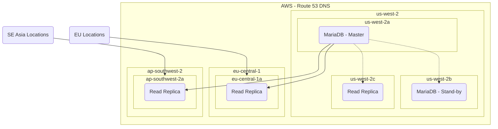

# Amazon RDS
- Managed database option for:
    - MySQL
    - Maria
    - PostgreSQL
    - Microsoft SQL Server
    - Oracle
    - MySQL-compatible Aurora
- Best for structured, relational data store needs
- Aims to be drop-in replacement for existing on-prem instances of the same databases
- Automated backups and patching in customer-defined maintenance windows
    - Can define customer-defined maintenance windows
- Push button scaling, replication, and redundancy

## RDS Anti-Patterns
| If you need...                                                           | Don't use RDS, instead use... |
| ------------------------------------------------------------------------ | ----------------------------- |
| Lots of large binary objects (BLOBs)                                     | S3                            |
| Automated scalability                                                    | DynamoDB                      |
| Name/Value Data Structure                                                | DynamoDB                      |
| Data is not well structured or unpredictabled                            | DynamoDB                      |
| Other database platforms like IBM DB2 or SAP HANA that are not supported | EC2                           |
| Complete control over the database                                       | EC2                           |

## Example Architecture
**Example:**
We Have a master database in `us-west-2a`, a stand-by database in `us-west-2b`, and a read replica in various locations to service the data for other availability zones/regions.

- RDS has multi-availability zone capability
- Read-replicas service regional users

> [!NOTE]
> Non-transactional storage engines like MyISAM do not support replication; you muyst use InnoDB (or XtraDB on Maria)

### How Does Replication work?
- Sync Replication
    - Replication between master and stand-by is synchronous
    - Data is instantly replicated
    - If master fails unexpectedly, stand-by will act as master until master is back online

- Async Replication
    - Replication between master and read replicas are asynchronous
    - Data may be a minute or a few seconds behind compared to master
**Example:** If the availability zone master is in dies, the stand-by database will assume the role of master and read replicas will continue to be async, but with standby instead of master

**Example:** If an entire region fails, a read replica can be promoted to master - however it is a two-step process. The replica must be promoted to a single availability zone instance, then reconfigured to be a multi-availability zone instance. This can be scripted via CloudWatch alarms, but promoting a read replica is usually a case where a whole regions fails, and would be safer to do this manually.

> [!NOTE]
> Maria DB RDS DBs can have one stand-by instance and multiple read replicas