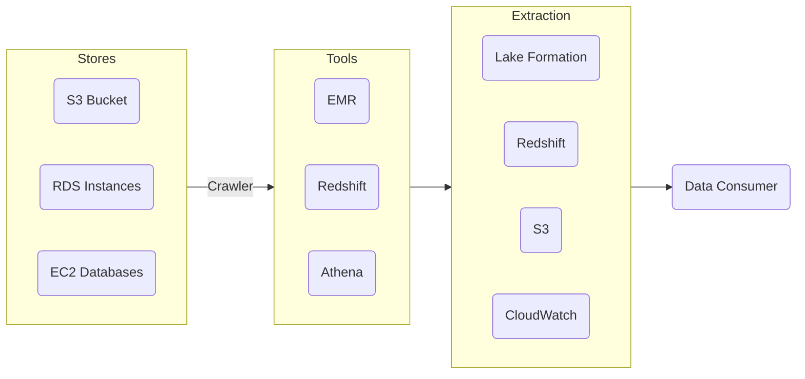
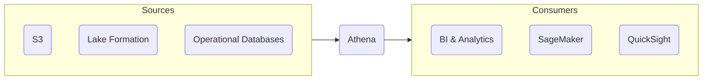

# Preparing Data for Analysis

## Data Ecosystems
- Data stores usually contains large amounts of data
- Users may want to access the data, however cannot get much insight from these data stores
- Data analysis tools such as QuickSight and SageMaker can provide insight through business/machine intelligence dashboards
- Most of the time, the data in these data stores are not prepared to be delivered yet
    - Data preparation tools such as Glue and Athena can be used to prepare data for analytic tools

## Extract, Transform, Load (ETL)
- When looking at data from data stores, most of the time, we will only be interested in subsets of the data
    - By extracting the data that we are concerned about, the data will be more focused and produce accurate insights
- The extracted data may not be in the form we need such as:
    - Duplicate data
    - Wrong formats
    - Unwanted fields
- Transforming the data can be done in the form of:
    - Cleaning
    - Standardizing
    - De-duplicating
    - Transformation
    - Combining
    - Sorting
    - Etc.
- Transformed data must then be loaded to an application or data stores needed that the analysis tools will use to consume the data to deliver it to its users

## Glue
- Used for ETL services at scale
- Can use Glue crawlers to discover new data
    - Crawlers can collect data from multiple data sources
- Prepares data with Glue data catalogs and Glue ETL jobs
- Can integrate data from disparate sources
- Serverless, AWS handles scaling
    - Automatically scales the processing and data storage

### Glue Data Quality
- Glue data quality provides data quality recommendations and predfined rules
- Helps ensure quality of Glue data
- Can set up alerts and data quality metrics to provide confidence

**Example:**
Based on the diagram above, a crawler is used to collect new data from multiple different data sources. Metadata to find where the relevant data, is stored in a Glue data catalog.
These data catalogs can be ingested directly by EMR, Redshift, or Athena which can do searches on the subset of data that has been defined in the data catalog.
If the data is still not in the form needed, a Glue ETL job can be leveraged via events or schedules to transformed the data into a catalog that can then be loaded to a new data source.
These services can be the final destination, but if needed, can be delivered to a data consumer tool such as QuickSite

## Athena
- Known to analyze petabyte-scale data where it lives
- Serverless big data querying service
- Designed to create databases from S3
    - Can use standard SQL to create queries from S3
- Can run Spark code with Apache Spark on Athena
    - This allows the ability to use Spark against S3

> [!NOTE]
> While Athena is designed for S3, users can still use it to analyze data from 25+ different data sources

**Example:**
Athena can act as an abstraction layer on top of data sources where SQL queries can be performed.
These results, usually subsets of data, can be plugged directly into consuming sources.

## Things to Take Away
- Most data ecosystems require some ETL
    - Collecting data is only valuable so long as you can draw insights from it
    - ETL can get data from raw to a curated state
- AWS Glue is a serverless ETL solution
    - Glue is a powerfull tool for crawling, cataloging, and transforming data from many different sources
    - Integrates with many other AWS services
- Athena extracts at a petabyte scale
    - Most use cases involve querying S3 objects
    - Can be used to perform federated queries on many data sources
